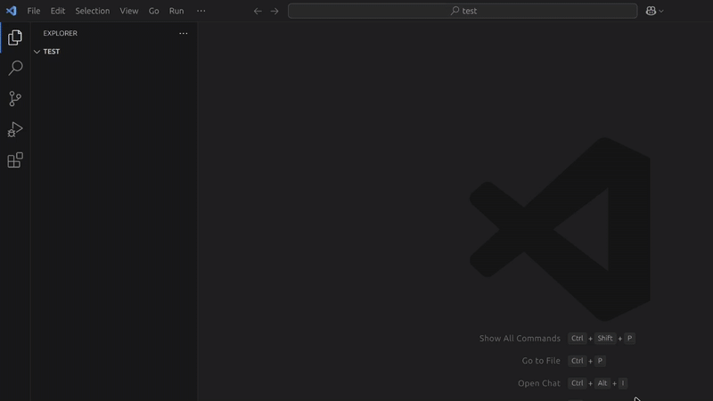

# 42 Orthodox
### Leave a star on [Github](https://github.com/PalmeseMattia/42Orthodox)
## Usage
To use the extension, launch the `Generate Class` command (`Ctrl+Shift+P` + `Generate Class`), write the name of the class and press Enter.

